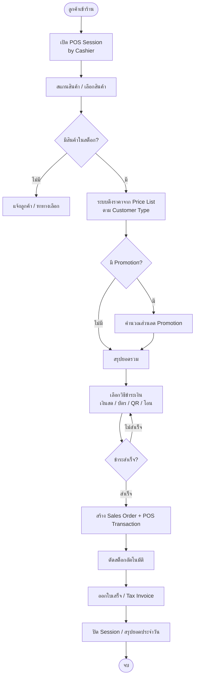
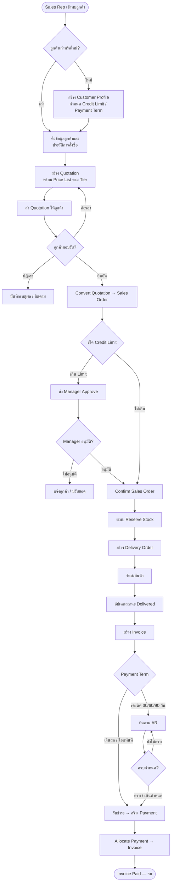
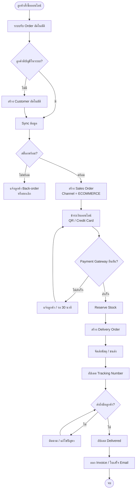
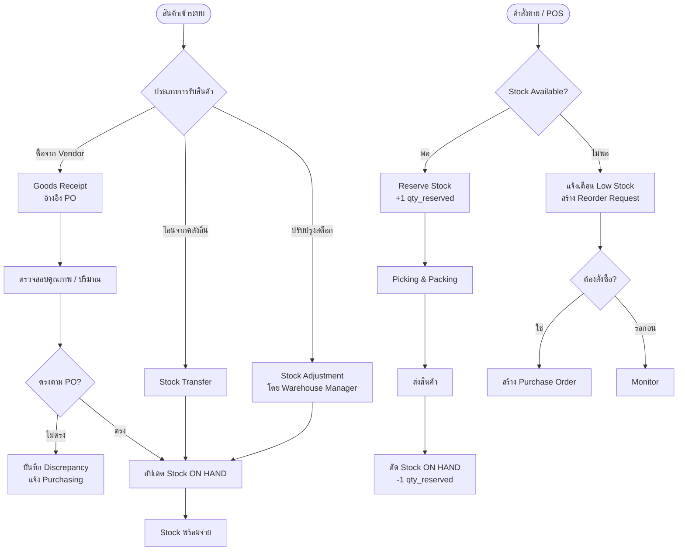
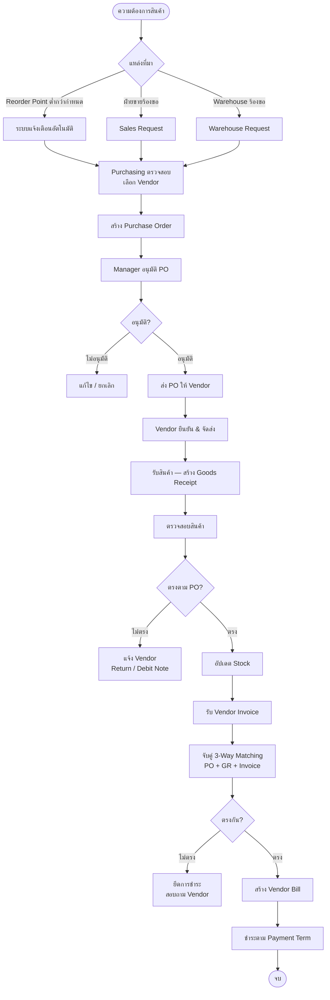
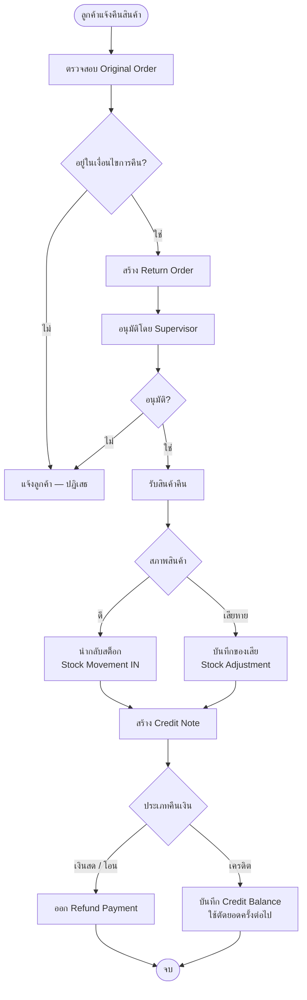
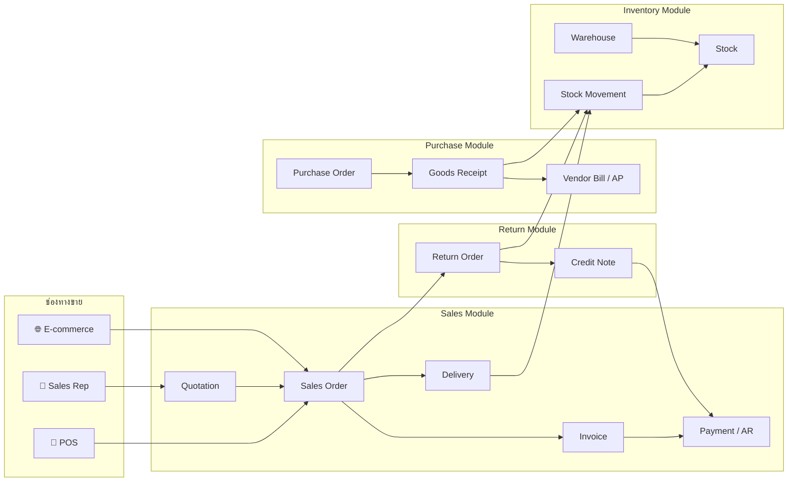

# ERP System — ABC Trading Co.
## Part 2: Business Workflow

---

## 1. Sales Workflow — ช่องทาง POS (หน้าร้าน)

---

## 2. Sales Workflow — ช่องทาง Sales Representative

---

## 3. Sales Workflow — ช่องทาง E-commerce

---

## 4. Inventory Management Workflow

---

## 5. Purchase / Procurement Workflow

---

## 6. Return & Refund Workflow

---

## 7. ภาพรวม Module และความเชื่อมโยง

---

## 8. Business Rules สำคัญ

| Rule | รายละเอียด |
|------|-----------|
| Credit Check | ทุก SO ของลูกค้า Wholesale ต้องเช็ค Credit Limit ก่อน Confirm |
| Price Tier | ราคาขึ้นกับ Customer Type (retail/wholesale) + Channel + Promotion |
| Stock Reserve | เมื่อ Confirm SO ระบบ Reserve Stock ทันที — ป้องกัน Over-sell |
| 3-Way Matching | ก่อนจ่ายเงิน Vendor ต้องตรวจสอบ PO + GR + Bill ตรงกัน |
| Return Window | กำหนดวันคืนสินค้าตามนโยบาย (เช่น 7 วัน) — ตรวจสอบอัตโนมัติ |
| POS Session | Cashier ต้อง Open/Close Session ทุกวัน — ยอดเงินสดต้องตรงกับระบบ |
| AR Aging | Invoice เกินกำหนดชำระ → แจ้งเตือน Sales Rep → Block Credit |
