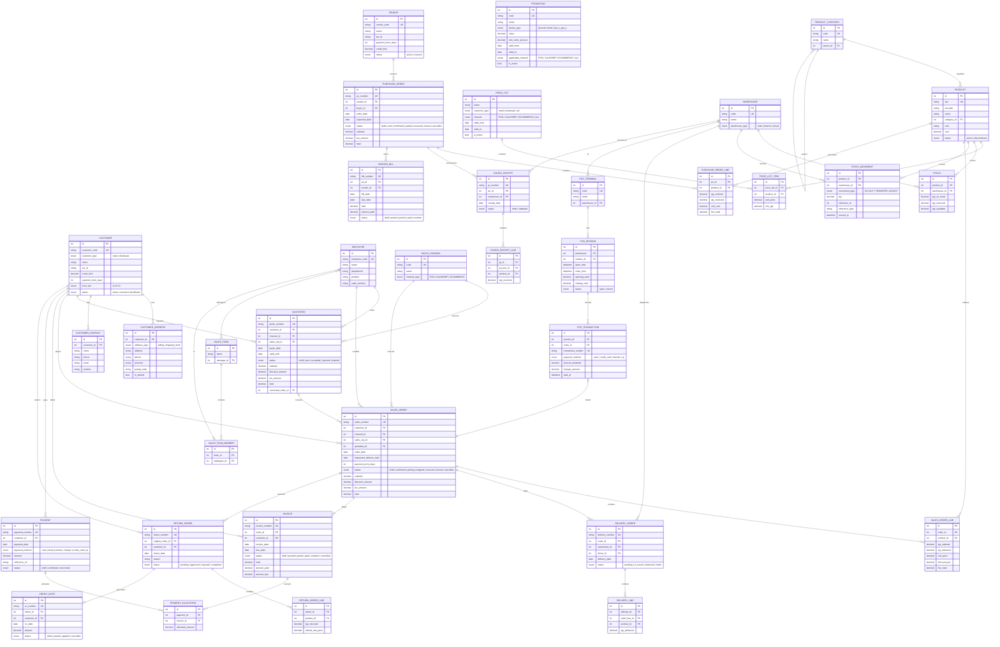

# ERP System — ABC Trading Co.
## Part 1: ER Diagram

```mermaid
erDiagram

  %% ─── CUSTOMER ───────────────────────────────────────────
  CUSTOMER {
    int     id PK
    string  customer_code UK
    enum    customer_type "retail | wholesale"
    string  name
    string  tax_id
    decimal credit_limit
    int     payment_term_days
    enum    price_tier "A | B | C"
    enum    status "active | inactive | blacklisted"
  }
  CUSTOMER_ADDRESS {
    int    id PK
    int    customer_id FK
    enum   address_type "billing | shipping | both"
    string address
    string district
    string province
    string postal_code
    bool   is_default
  }
  CUSTOMER_CONTACT {
    int    id PK
    int    customer_id FK
    string name
    string phone
    string email
    string position
  }

  %% ─── EMPLOYEE / SALES REP ───────────────────────────────
  EMPLOYEE {
    int    id PK
    string employee_code UK
    string name
    string department
    string position
    string sales_territory
  }
  SALES_TEAM {
    int id PK
    string name
    int manager_id FK
  }
  SALES_TEAM_MEMBER {
    int id PK
    int team_id FK
    int employee_id FK
  }

  %% ─── PRODUCT ────────────────────────────────────────────
  PRODUCT_CATEGORY {
    int    id PK
    string code UK
    string name
    int    parent_id FK
  }
  PRODUCT {
    int     id PK
    string  sku UK
    string  barcode
    string  name
    int     category_id FK
    string  uom
    decimal cost
    enum    status "active | discontinued"
  }
  PRICE_LIST {
    int     id PK
    string  name
    enum    customer_type "retail | wholesale | all"
    enum    channel "POS | SALESREP | ECOMMERCE | ALL"
    date    valid_from
    date    valid_to
    bool    is_active
  }
  PRICE_LIST_ITEM {
    int     id PK
    int     price_list_id FK
    int     product_id FK
    decimal unit_price
    decimal min_qty
  }
  PROMOTION {
    int     id PK
    string  code UK
    string  name
    enum    promo_type "percent | fixed | buy_x_get_y"
    decimal value
    decimal min_order_amount
    date    valid_from
    date    valid_to
    enum    applicable_channel "POS | SALESREP | ECOMMERCE | ALL"
    bool    is_active
  }

  %% ─── INVENTORY ──────────────────────────────────────────
  WAREHOUSE {
    int    id PK
    string code UK
    string name
    enum   warehouse_type "main | branch | virtual"
  }
  STOCK {
    int     id PK
    int     product_id FK
    int     warehouse_id FK
    decimal qty_on_hand
    decimal qty_reserved
    decimal qty_available
  }
  STOCK_MOVEMENT {
    int     id PK
    int     product_id FK
    int     warehouse_id FK
    enum    movement_type "IN | OUT | TRANSFER | ADJUST"
    decimal qty
    int     reference_id
    string  reference_type
    datetime moved_at
  }

  %% ─── SALES CHANNEL ──────────────────────────────────────
  SALES_CHANNEL {
    int    id PK
    string code UK
    string name
    enum   channel_type "POS | SALESREP | ECOMMERCE"
  }

  %% ─── QUOTATION ──────────────────────────────────────────
  QUOTATION {
    int      id PK
    string   quote_number UK
    int      customer_id FK
    int      channel_id FK
    int      sales_rep_id FK
    date     quote_date
    date     valid_until
    enum     status "draft | sent | accepted | rejected | expired"
    decimal  subtotal
    decimal  discount_amount
    decimal  tax_amount
    decimal  total
    int      converted_order_id FK
  }

  %% ─── SALES ORDER ────────────────────────────────────────
  SALES_ORDER {
    int      id PK
    string   order_number UK
    int      customer_id FK
    int      channel_id FK
    int      sales_rep_id FK
    int      quotation_id FK
    date     order_date
    date     requested_delivery_date
    int      payment_term_days
    enum     status "draft | confirmed | picking | shipped | invoiced | closed | cancelled"
    decimal  subtotal
    decimal  discount_amount
    decimal  tax_amount
    decimal  total
  }
  SALES_ORDER_LINE {
    int     id PK
    int     order_id FK
    int     product_id FK
    decimal qty_ordered
    decimal qty_delivered
    decimal unit_price
    decimal discount_pct
    decimal line_total
  }

  %% ─── POS ────────────────────────────────────────────────
  POS_TERMINAL {
    int    id PK
    string code UK
    string name
    int    warehouse_id FK
  }
  POS_SESSION {
    int      id PK
    int      terminal_id FK
    int      cashier_id FK
    datetime open_time
    datetime close_time
    decimal  opening_cash
    decimal  closing_cash
    enum     status "open | closed"
  }
  POS_TRANSACTION {
    int      id PK
    int      session_id FK
    int      order_id FK
    string   transaction_number UK
    enum     payment_method "cash | credit_card | transfer | qr"
    decimal  amount_tendered
    decimal  change_amount
    datetime paid_at
  }

  %% ─── DELIVERY ───────────────────────────────────────────
  DELIVERY_ORDER {
    int    id PK
    string delivery_number UK
    int    order_id FK
    int    warehouse_id FK
    int    driver_id FK
    date   delivery_date
    enum   status "pending | in_transit | delivered | failed"
  }
  DELIVERY_LINE {
    int     id PK
    int     delivery_id FK
    int     order_line_id FK
    int     product_id FK
    decimal qty_delivered
  }

  %% ─── INVOICE & PAYMENT ──────────────────────────────────
  INVOICE {
    int      id PK
    string   invoice_number UK
    int      order_id FK
    int      customer_id FK
    date     invoice_date
    date     due_date
    enum     status "draft | posted | partial | paid | overdue | cancelled"
    decimal  total
    decimal  amount_paid
    decimal  amount_due
  }
  PAYMENT {
    int      id PK
    string   payment_number UK
    int      customer_id FK
    date     payment_date
    enum     payment_method "cash | bank_transfer | cheque | credit_card | qr"
    decimal  amount
    string   reference_no
    enum     status "draft | confirmed | reconciled"
  }
  PAYMENT_ALLOCATION {
    int     id PK
    int     payment_id FK
    int     invoice_id FK
    decimal allocated_amount
  }

  %% ─── RETURN ─────────────────────────────────────────────
  RETURN_ORDER {
    int    id PK
    string return_number UK
    int    original_order_id FK
    int    customer_id FK
    date   return_date
    string reason
    enum   status "pending | approved | rejected | completed"
  }
  RETURN_ORDER_LINE {
    int     id PK
    int     return_id FK
    int     product_id FK
    decimal qty_returned
    decimal refund_unit_price
  }
  CREDIT_NOTE {
    int      id PK
    string   cn_number UK
    int      return_id FK
    int      customer_id FK
    date     cn_date
    decimal  amount
    enum     status "draft | posted | applied | cancelled"
  }

  %% ─── PURCHASE ───────────────────────────────────────────
  VENDOR {
    int     id PK
    string  vendor_code UK
    string  name
    string  tax_id
    int     payment_term_days
    decimal credit_limit
    enum    status "active | inactive"
  }
  PURCHASE_ORDER {
    int      id PK
    string   po_number UK
    int      vendor_id FK
    int      buyer_id FK
    date     order_date
    date     expected_date
    enum     status "draft | sent | confirmed | partial | received | closed | cancelled"
    decimal  subtotal
    decimal  tax_amount
    decimal  total
  }
  PURCHASE_ORDER_LINE {
    int     id PK
    int     po_id FK
    int     product_id FK
    decimal qty_ordered
    decimal qty_received
    decimal unit_cost
    decimal line_total
  }
  GOODS_RECEIPT {
    int    id PK
    string gr_number UK
    int    po_id FK
    int    warehouse_id FK
    date   receipt_date
    enum   status "draft | validated"
  }
  GOODS_RECEIPT_LINE {
    int     id PK
    int     gr_id FK
    int     po_line_id FK
    int     product_id FK
    decimal qty_received
  }
  VENDOR_BILL {
    int      id PK
    string   bill_number UK
    int      po_id FK
    int      vendor_id FK
    date     bill_date
    date     due_date
    decimal  total
    decimal  amount_paid
    enum     status "draft | posted | partial | paid | overdue"
  }

  %% ─── RELATIONSHIPS ──────────────────────────────────────

  CUSTOMER             ||--o{ CUSTOMER_ADDRESS    : "has"
  CUSTOMER             ||--o{ CUSTOMER_CONTACT    : "has"
  CUSTOMER             ||--o{ QUOTATION           : "requests"
  CUSTOMER             ||--o{ SALES_ORDER         : "places"
  CUSTOMER             ||--o{ INVOICE             : "billed"
  CUSTOMER             ||--o{ PAYMENT             : "pays"
  CUSTOMER             ||--o{ RETURN_ORDER        : "returns"

  EMPLOYEE             ||--o{ QUOTATION           : "owns"
  EMPLOYEE             ||--o{ SALES_ORDER         : "handles"
  EMPLOYEE             }o--o{ SALES_TEAM          : "belongs to"
  SALES_TEAM           ||--o{ SALES_TEAM_MEMBER   : "contains"
  SALES_TEAM_MEMBER    }|--|| EMPLOYEE            : "is"

  PRODUCT_CATEGORY     ||--o{ PRODUCT             : "classifies"
  PRODUCT_CATEGORY     ||--o{ PRODUCT_CATEGORY    : "parent"
  PRODUCT              ||--o{ PRICE_LIST_ITEM     : "priced via"
  PRICE_LIST           ||--o{ PRICE_LIST_ITEM     : "contains"

  PRODUCT              ||--o{ STOCK               : "stored"
  WAREHOUSE            ||--o{ STOCK               : "holds"
  WAREHOUSE            ||--o{ STOCK_MOVEMENT      : "records"
  PRODUCT              ||--o{ STOCK_MOVEMENT      : "moved"

  SALES_CHANNEL        ||--o{ QUOTATION           : "sourced"
  SALES_CHANNEL        ||--o{ SALES_ORDER         : "sourced"

  QUOTATION            ||--o{ SALES_ORDER         : "converts"
  SALES_ORDER          ||--o{ SALES_ORDER_LINE    : "contains"
  PRODUCT              ||--o{ SALES_ORDER_LINE    : "ordered"

  SALES_ORDER          ||--o{ DELIVERY_ORDER      : "ships"
  DELIVERY_ORDER       ||--o{ DELIVERY_LINE       : "contains"
  WAREHOUSE            ||--o{ DELIVERY_ORDER      : "dispatches"

  SALES_ORDER          ||--|{ INVOICE             : "billed"
  INVOICE              ||--o{ PAYMENT_ALLOCATION  : "receives"
  PAYMENT              ||--o{ PAYMENT_ALLOCATION  : "allocates"

  SALES_ORDER          ||--o{ RETURN_ORDER        : "reversed"
  RETURN_ORDER         ||--o{ RETURN_ORDER_LINE   : "contains"
  RETURN_ORDER         ||--o| CREDIT_NOTE         : "generates"

  POS_TERMINAL         ||--o{ POS_SESSION         : "runs"
  POS_SESSION          ||--o{ POS_TRANSACTION     : "records"
  POS_TRANSACTION      }|--|| SALES_ORDER         : "linked"
  WAREHOUSE            ||--o{ POS_TERMINAL        : "at"

  VENDOR               ||--o{ PURCHASE_ORDER      : "receives"
  PURCHASE_ORDER       ||--o{ PURCHASE_ORDER_LINE : "contains"
  PRODUCT              ||--o{ PURCHASE_ORDER_LINE : "purchased"
  PURCHASE_ORDER       ||--o{ GOODS_RECEIPT       : "received via"
  GOODS_RECEIPT        ||--o{ GOODS_RECEIPT_LINE  : "contains"
  WAREHOUSE            ||--o{ GOODS_RECEIPT       : "receives at"
  PURCHASE_ORDER       ||--o{ VENDOR_BILL         : "billed"
```
